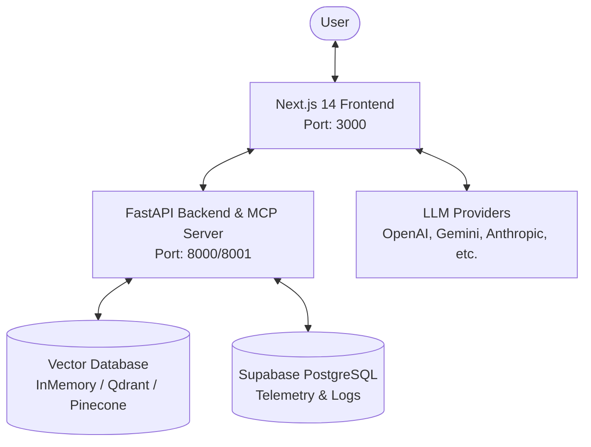

# 🤖 MCPPro Intelligence System

Welcome to the **MCPPro Intelligence System**, a production-grade, state-of-the-art AI agent and Document RAG (Retrieval-Augmented Generation) orchestration platform. MCPPro features a decoupled architecture with a modern Next.js frontend, a robust FastAPI backend, support for the **Model Context Protocol (MCP)**, and native containerization.

---

## 🏗️ System Architecture



MCPPro is split into three main components:
1. **Frontend (Next.js 14 Web App)**: Implements interactive chat interfaces, document upload workflows, and an API gateway for serverless LLM/MCP orchestrations. Exposes pages optimized for user interaction and real-time streaming responses.
2. **Backend (FastAPI Python Microservice)**: Drives the agentic RAG pipeline, providing document parsing (PDF, DOCX, TXT, OCR), chunking, and embedding. It also runs a **Model Context Protocol (MCP)** server via FastMCP to expose RAG tools.
3. **Database & Storage**: Integrates with PostgreSQL (Supabase) for logging agent executions and vector databases (SQLite/In-Memory, Qdrant, or Pinecone) for high-performance semantic search.

---

## 🚀 Quick Start

### 📋 Prerequisites
Make sure you have the following installed on your machine:
- **Node.js**: `18.x` or later (with `npm` package manager)
- **Python**: `3.12.x` (recommended)
- **Docker & Docker Compose**: For containerized setup
- **Tesseract OCR**: For image-based document parsing (optional)

---

### 1. Unified Local Execution (Docker Compose)

The easiest way to run the entire stack (Next.js frontend, FastAPI backend, and Qdrant vector store) is using Docker Compose:

```bash
# Clone the repository and navigate to root
cd MCPPRO-agent-main

# Start all services in the background
docker compose up -d
```

Once running, access the services at:
*   **Frontend**: [http://localhost:3000](http://localhost:3000)
*   **FastAPI Backend**: [http://localhost:8000](http://localhost:8000)
*   **API Documentation**: [http://localhost:8000/docs](http://localhost:8000/docs)
*   **Qdrant Console**: [http://localhost:6333/dashboard](http://localhost:6333/dashboard)

---

### 2. Manual Development Setup

If you prefer to run the components manually for development:

#### A. Backend Setup
1. Navigate to the backend directory:
   ```bash
   cd backend
   ```
2. Create and activate a Python virtual environment:
   ```bash
   # Windows PowerShell
   python -m venv venv
   .\venv\Scripts\Activate.ps1

   # macOS/Linux
   python -m venv venv
   source venv/bin/activate
   ```
3. Install dependencies:
   ```bash
   pip install -r requirements.txt
   pip install -r requirements-mcp.txt
   ```
4. Copy the environment template and configure your keys:
   ```bash
   cp env.example .env
   # Edit the .env file with your API keys (OpenAI, Gemini, Supabase, etc.)
   ```
5. Start the backend services:
   ```bash
   # Start FastAPI Server (Port 8000)
   python main.py

   # Start MCP Server (Port 8001, optional in a separate shell)
   python run_mcp.py
   ```

#### B. Frontend Setup
1. Navigate to the frontend directory:
   ```bash
   cd ../frontend
   ```
2. Install dependencies:
   ```bash
   npm install
   ```
3. Copy the environment variables:
   ```bash
   cp env.example .env.local
   # Edit .env.local with Supabase keys and LLM settings
   ```
4. Start the Next.js development server:
   ```bash
   npm run dev
   ```
   Access the frontend at [http://localhost:3000](http://localhost:3000).

---

## ⚙️ Environment Variables Configuration

Both frontend and backend rely on configuration files (`.env` and `.env.local` respectively). Key configuration values include:

| Key | Description | Recommended / Example |
| :--- | :--- | :--- |
| `ENVIRONMENT` | Deployment environment | `development` / `production` |
| `DEFAULT_VECTOR_STORE` | Target vector database | `inmemory` / `qdrant` / `pinecone` |
| `DEFAULT_LLM_PROVIDER` | Default LLM service | `openai` / `gemini` / `anthropic` |
| `SUPABASE_URL` | Supabase API Endpoint | `https://your-project.supabase.co` |
| `SUPABASE_SERVICE_KEY` | Relational & logs storage key | `your-supabase-service-key` |
| `OPENAI_API_KEY` | OpenAI authentication | `sk-proj-...` |
| `GEMINI_API_KEY` | Gemini authentication | `AIzaSy...` |

> [!NOTE]
> Detailed database schemas (`database_setup.sql` and `supabase_vector_setup.sql`) are located under [backend/schemas](file:///D:/Antigravity/Major-project/MCPPRO%20agent-main/backend/schemas) to set up request tracking and `pgvector` tables on Supabase.

---

## 🛠️ CI/CD Pipeline

The project is configured with an automated CI/CD pipeline using GitHub Actions, located in [.github/workflows/ci-cd.yml](file:///D:/Antigravity/Major-project/MCPPRO%20agent-main/.github/workflows/ci-cd.yml). 

The pipeline runs validation steps on every push and pull request to `main`, `master`, and `dev` branches:
- **Backend CI**: Sets up Python 3.12, installs dependencies via `uv`, compiles backend code, and runs a dry-run Docker build using `docker/setup-buildx-action` and `docker/build-push-action`.
- **Frontend CI**: Sets up Node 18, synchronizes dependencies, validates Next.js builds, and performs a dry-run Docker build.

---

## 📈 RAG Evaluation & Diagnostics

To verify the quality and latency of the RAG (Retrieval-Augmented Generation) search engine, run the automated evaluation runner:

```bash
cd backend
python scripts/evaluate_rag.py
```

This evaluations suite tests index latency, query-answering latency, and cosine similarity relevancy score against a golden dataset of target documents.

---

## 📄 Production Readiness
For production deployments, high-availability architecture, failover guidelines, and scaling checklists, please consult the complete [PRODUCTION_READINESS.md](file:///D:/Antigravity/Major-project/MCPPRO%20agent-main/PRODUCTION_READINESS.md).
