# MCPPRO - System Architecture Specification

## 1. Overview

MCPPRO is a dual-path Retrieval-Augmented Generation (RAG) and agent orchestration platform. The system uses a complexity-aware routing mechanism to serve simple fact-retrieval queries via direct vector similarity search and complex multi-step reasoning queries via an agentic workflow powered by the Model Context Protocol (MCP).

---

## 2. System Architecture Diagram

```mermaid
flowchart TB
    %% 1. PRESENTATION LAYER
    subgraph PRESENTATION_LAYER ["1. PRESENTATION LAYER (Next.js / React)"]
        direction LR
        Admin_UI["Admin Dashboard\n- File Upload & Document Ingestion\n- System, LLM & Tool Configuration\n- Analytics & Request History"]
        User_UI["User Chat Interface\n- Question & Prompt Submission\n- Real-time SSE Stream Output\n- Chat History Display\n(Context automatically resolved by backend)"]
    end

    %% 2. ORCHESTRATION LAYER
    subgraph ORCHESTRATION_LAYER ["2. ORCHESTRATION LAYER (Next.js API Routes)"]
        Auth_Middleware["Authentication Middleware\n(Supabase JWT and Role Validation)"]
        
        subgraph API_Routes ["API Endpoints"]
            API_Docs["/api/documents\n- Validates uploaded files\n- Forwards ingestion to FastAPI"]
            API_Chat["/api/chat\n- Handles chat sessions and prompts\n- Invokes Complexity Classifier\n- Streams responses back via SSE"]
            API_Requests["/api/requests\n- Logs latency, tokens, classification\n- Serves audit and analytics data"]
        end
    end

    %% 3. PROCESSING LAYER
    subgraph PROCESSING_LAYER ["3. PROCESSING LAYER (FastAPI / Python)"]
        
        %% Document Processing Pipeline
        subgraph Doc_Pipeline ["Document Processing Pipeline (Ingestion / Pre-Query)"]
            Doc_Processor["Document Processor\n1. File Validation and MIME Detection\n2. Extraction (PyMuPDF, python-docx, python-pptx, OCR)\n3. Semantic Text Chunking"]
        end

        %% Query Processing Pipeline
        subgraph Query_Pipeline ["Query Processing Pipeline (Runtime Execution)"]
            Classifier["Complexity Classifier\n(Analyzes reasoning depth and query intent)"]
            
            subgraph Traditional_RAG_Block ["Traditional RAG Engine (Simple Queries)"]
                Trad_RAG["Traditional RAG Controller\n- Context Assembly: Chunks + Original Prompt\n- Single-pass grounded generation"]
            end
            
            subgraph Agentic_RAG_Block ["Agentic RAG Engine (Complex Queries)"]
                LLM_Agent["LLM ReAct Agent\n- Multi-step reasoning loops\n- Tool call decision engine"]
                
                subgraph MCP_System ["Model Context Protocol (MCP)"]
                    MCP_Core["MCP Protocol Interface"]
                    Tool_Doc["Document Search Tool"]
                    Tool_Trad["Traditional RAG Tool"]
                    Tool_Web["Web Search Tool"]
                end
            end
        end
    end

    %% 4. DATA LAYER
    subgraph DATA_LAYER ["4. DATA LAYER"]
        subgraph Docker_Env ["Docker Container Environment"]
            Qdrant_DB[("Qdrant Vector Database\n- HNSW Graph Indexing\n- Stores Vectors, Text Chunks and Metadata\n- Payload-based metadata filtering")]
            Docker_Vol[("Docker Persistent Storage Volume")]
            Qdrant_DB --- Docker_Vol
        end

        Supabase_DB[("Supabase (PostgreSQL)\n- User Accounts and RBAC Roles\n- Document Metadata and Ingestion State\n- Request Logs and Execution Latency\n- Tool-Call Tracing and Telemetry\n- System Analytics")]
    end

    %% 5. EXTERNAL SERVICES
    subgraph EXTERNAL_SERVICES ["5. EXTERNAL SERVICES"]
        direction TB
        Embedding_API["Embedding Service\n(OpenAI / BGE / Local)\n[Text -> Vector]"]
        LLM_API["LLM Provider Service\n(OpenAI / Anthropic Claude / Google Gemini)\n[Context + Prompt -> Response]"]
        Tavily_API["Tavily Web Search API\n(Real-time Web Search Grounding)"]
    end

    %% CONNECTIONS & FLOWS
    
    %% Ingestion & Auth
    Admin_UI -->|"HTTPS (Admin Upload)"| Auth_Middleware
    User_UI -->|"HTTPS (User Prompt)"| Auth_Middleware
    Auth_Middleware -->|"Validated Admin Token"| API_Docs
    Auth_Middleware -->|"Validated User Token"| API_Chat
    Auth_Middleware -.->|"Verify JWT and Roles"| Supabase_DB

    %% Flow A: Document Ingestion Pipeline
    API_Docs -->|"1. Forward File Data"| Doc_Processor
    Doc_Processor -->|"2. Send Chunks for Vectorization"| Embedding_API
    Embedding_API -->|"3. Return Chunk Embeddings"| Doc_Processor
    Doc_Processor -->|"4. Write Vectors + Chunks + Metadata"| Qdrant_DB
    Doc_Processor -->|"5. Store Metadata and Status"| Supabase_DB

    %% Flow B: Query Routing
    API_Chat -->|"1. Pass Prompt"| Classifier
    Classifier -->|"Log Query State"| Supabase_DB
    Classifier -->|"Simple Query"| Trad_RAG
    Classifier -->|"Complex Query"| LLM_Agent

    %% Flow B: Traditional RAG Execution
    Trad_RAG -->|"2. Send Prompt to Vectorize"| Embedding_API
    Embedding_API -->|"3. Return Query Vector"| Trad_RAG
    Trad_RAG -->|"4. Similarity Search (Vector, Top-K)"| Qdrant_DB
    Qdrant_DB -->|"5. Return Top-K Chunks"| Trad_RAG
    Trad_RAG -->|"6. Pass [Original User Prompt + Retrieved Chunks]"| LLM_API
    LLM_API -->|"7. Return Grounded Response"| Trad_RAG
    Trad_RAG -->|"8. Stream Response via SSE"| API_Chat
    Trad_RAG -->|"Log Request and Latency"| Supabase_DB

    %% Flow C: Agentic RAG Execution
    LLM_Agent -->|"Coordinate Tools"| MCP_Core
    MCP_Core --- Tool_Doc
    MCP_Core --- Tool_Trad
    MCP_Core --- Tool_Web

    Tool_Doc -->|"Vector and Payload Search"| Qdrant_DB
    Qdrant_DB -->|"Return Relevant Chunks"| Tool_Doc
    Tool_Trad -->|"Execute Sub-RAG Search"| Trad_RAG
    Tool_Web -->|"Fetch Web Data"| Tavily_API
    Tavily_API -->|"Return Search Results"| Tool_Web

    Tool_Doc -->|"Tool Result"| LLM_Agent
    Tool_Trad -->|"Tool Result"| LLM_Agent
    Tool_Web -->|"Tool Result"| LLM_Agent
    
    LLM_Agent -->|"Iterative Reasoning"| LLM_API
    LLM_API -->|"Synthesized Response"| LLM_Agent
    LLM_Agent -->|"Stream Final Response via SSE"| API_Chat
    LLM_Agent -->|"Log Tool Calls and Iterations"| Supabase_DB

    %% Client Output
    API_Chat -->|"Server-Sent Events (SSE) Stream"| User_UI
    API_Requests <-->|"Read Analytics and Logs"| Supabase_DB
    Admin_UI <-->|"View Telemetry and Audit Logs"| API_Requests
```

---

## 3. Layer Architecture Breakdown

### 1. Presentation Layer (Next.js / React)
- **Admin Dashboard**: System administration portal for uploading documents, selecting LLM and embedding configurations, monitoring request metrics, and tracking ingestion status.
- **User Chat Interface**: Clean conversational interface for submitting prompts and receiving streaming text responses. The backend automatically determines the relevant document context (no manual document selection required).

### 2. Orchestration Layer (Next.js API Routes)
- **Authentication Middleware**: Verifies incoming request headers against Supabase Auth (JWT validation) and checks user roles before passing traffic to downstream routes.
- **/api/documents**: Admin endpoint that validates uploaded files and forwards them to FastAPI for document processing.
- **/api/chat**: Client endpoint for conversational queries. Manages connection state, triggers the Complexity Classifier, and streams answers back to the UI via Server-Sent Events (SSE).
- **/api/requests**: Endpoint serving system telemetry, query history, latency stats, and classification metrics.

### 3. Processing Layer (FastAPI / Python)
- **Document Processing Pipeline (Pre-Query Phase)**:
  - Validates and identifies file MIME types (PDF, DOCX, PPTX, image formats).
  - Extracts text using PyMuPDF, python-docx, python-pptx, and OCR fallback for scanned materials.
  - Recursively chunks text into semantic segments with overlap.
  - Sends text chunks to the Embedding Service and writes vectors, chunks, and metadata directly into Qdrant.
- **Complexity Classifier**:
  - Evaluates incoming questions based on required reasoning depth.
  - Categorizes queries as either **Simple** (single-fact extraction) or **Complex** (multi-step comparison, synthesis, external search).
- **Traditional RAG Engine**:
  - Converts user prompts to query vectors via the Embedding Service.
  - Performs top-K similarity search against Qdrant.
  - Combines the original user prompt with retrieved document context and invokes the LLM for grounded generation.
- **Agentic RAG Engine**:
  - Runs an LLM-driven ReAct agent capable of iterative tool calling.
  - Dispatches tools standardized via the Model Context Protocol (MCP):
    - Document Search Tool: Queries Qdrant for semantic chunks.
    - Traditional RAG Tool: Calls the standard RAG pipeline for sub-questions.
    - Web Search Tool: Queries Tavily for live external information.

### 4. Data Layer
- **Qdrant (Docker Container)**:
  - Runs inside a dedicated Docker container backed by persistent storage.
  - Utilizes Hierarchical Navigable Small World (HNSW) indexing for approximate nearest neighbor search.
  - Stores high-dimensional vector embeddings, raw text chunks, and payload metadata (e.g., document ID, page numbers).
- **Supabase (PostgreSQL)**:
  - Relational control plane storing user authentication records, RBAC permissions, document ingestion metadata, request logs, latency metrics, and tool execution traces.
  - Dedicated strictly to relational and audit data (not used for vector search).

### 5. External Services
- **Embedding Service** (OpenAI / BGE / Local): Converts text into vector embeddings. Used during document ingestion (for chunks) and query retrieval (for user prompts).
- **LLM Provider Service** (OpenAI / Anthropic Claude / Google Gemini): Generates natural-language responses and powers the ReAct agent's multi-step reasoning.
- **Tavily Web Search API**: Provides external web grounding for queries requiring live or real-world information.

---

## 4. Architectural Rules and Invariants

1. **Embedding Service vs LLM Service Separation**: The Embedding Service is strictly a text-to-vector transformer, while the LLM Service is a reasoning and text generation engine.
2. **User Prompt Preservation**: The original natural-language prompt is never replaced by its embedding; the embedding is used solely for vector retrieval, and the original prompt is passed alongside retrieved context to the LLM.
3. **Qdrant Interaction Boundaries**: Document Processor performs write operations to Qdrant during ingestion. The RAG and agent layers perform read/search operations during query execution. Qdrant never communicates directly with the LLM.
4. **Isolated Vector Storage**: High-dimensional vector search is handled exclusively by Qdrant in Docker, while relational state, authentication, and audit logs reside in Supabase.
